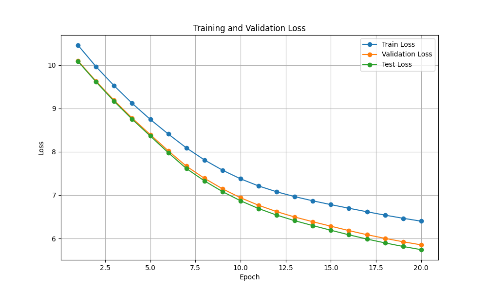
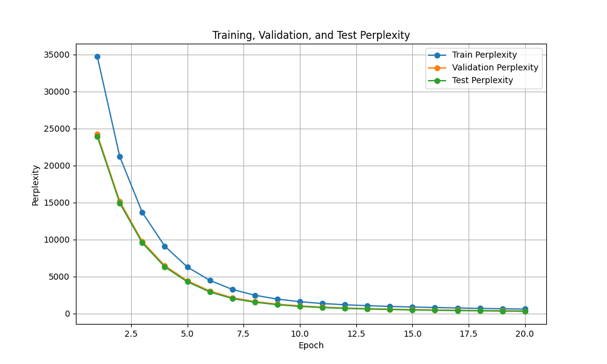

# Decoder Based Transformer - Homework 1

### Modification to original code

The original code for this homework was an Encoder-Decoder Transformer architecture that had a source and target vocabulary while also using cross-attention. To alter this into a decoder only autoregressive language model, the first step was to get rid of the encoder completely. I commented out the original encoder and changed the input paramteres to the decoder to exclude the output of the encoder (). Second, the cross-attention is no longer needed. Self-attention is the only thing this model needs to utilize. For this reason, the lines that performed cross attention using the MultiheadAttention class in the `DecoderLayer` class were commented out (). After this, a single vocabulary size was taken from the corpus gathered from the tokenizer, replacing the need for a target and source vocab. The vocab was then tokenized, embedded, then shifted to get the input and prediction tensors. Next, the model needed to be able to handle any batch sizes for optimal training, so I created a data_generator class that generates the data in batches with padding. This function returns the input and target sequences that are passed into the transformer architecture. 

Finally, the training, validation, and test functions were created to train the decoder transformer model. The `train_model()` function orchestrates the training loop, processing batches of tokenized text with gradient updates, logging loss and perplexity, and periodically saving model checkpoints, while also calling `validate_model()` and `test_model()` after each epoch. These evaluation functions share a similar structure: they disable gradient computation (`torch.no_grad()`), compute masked autoregressive predictions using the same `nopeak_mask` as training, and calculate cross-entropy loss (ignoring padding tokens) and perplexity, but differ in their data sources (validation or test sets) and batch iteration handling. All three functions log epoch-wise metrics (loss and perplexity) to both console and a file, enabling performance tracking across the training lifecycle. The unified design ensures consistent behavior across training and evaluation while maintaining separation between training dynamics (optimizer steps, gradient clipping) and inference-mode evaluation.

---

### Results 

The final test perplexity is 312.13

---

### Hyperparameters

This assignment required that the model was trained with:
- Epochs: 20
- Embedding Dimension: 512
- Attention Heads: 8
- Layers: 6
- Sequence Length: 512
- Dropout Rate: 0.1

This leaves these hyperparameters to tune:

- Learning Rate: 0.00001
This number seemed low enough for smooth continuous training and to not have to worry about instability

- Batch Size: 64
This is a common batch size and this seemed to give me the optimal training time vs. perplexity metrics 

---

### Training Script and weights

The training script can be found in starter.py and the weights are saved in the `model_weights` directory

---

### Training on Wikitext-103

Tokens/sec (epoch): 116701.73

This training speed is not too bad, but there are several ways to improve it. Some of these might include increasing the batch size or seqeunce length, to looks at more tokens in parallel.

---

### Replaced Attention with Euclidean distance: Results

The results from the  euclidean distance style transformer still perform very well on the wiki2 dataset. In fact, it outperforms the attention style. Unfortunately, the training time took much longer considering the face the batch had to be lowered from 64 to 8, due to memory constraints from the GPU. While the `attention` function uses the scaled dot product to  capture realtionships within context, euclidean distance just uses the  distance within the  multi-dimensional space, making it less flexible (and the reason it takes longer to train).

The model weights can be found in the  `model_weights_distance` folder

The final Test Perplexity is 141.19

